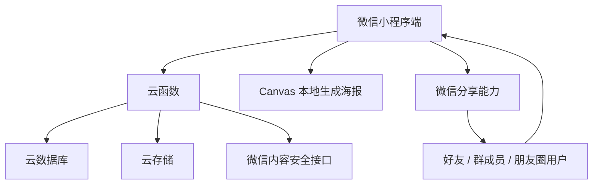

# 同一天生日微信小程序

> 纯微信小程序云开发版  
> 技术路线：微信原生小程序 + 微信云开发 + 云函数 + 云数据库 + 云存储  
> 产品形态：生日缘分测试 / 好友匹配 / 分享裂变 / 图鉴收集 / 群聊生日局

## 项目简介

「同一天生日」是一款基于生日信息的微信小程序，核心目标是让用户输入生日生成个人生日卡和唯一 CPID，并通过好友分享、群聊分享、朋友圈分享等方式邀请其他用户参与匹配，生成双人生日缘分结果，解锁图鉴并继续传播。

项目重点不是“生日查询”，而是围绕微信社交关系设计一个完整裂变闭环：

```text
输入生日
→ 生成生日卡
→ 生成 CPID
→ 分享给好友 / 群聊 / 朋友圈
→ 好友输入生日
→ 生成双人生日缘分结果
→ 解锁图鉴
→ 保存海报
→ 再次分享
```

## 核心能力

- 生日信息录入与校验
- 唯一 CPID 生成
- 个人生日卡展示
- 好友通过 CPID 或分享链接进入匹配
- 双人生日缘分结果生成
- 图鉴解锁与展示
- 群聊生日局
- Canvas 本地生成分享海报
- 分享行为与关键转化埋点
- 用户数据删除与隐私保护
- 云函数限流与基础风控

## 技术架构



## 技术栈

| 模块 | 技术方案 |
| --- | --- |
| 小程序前端 | 微信原生小程序 |
| 后端服务 | 微信云函数 Node.js |
| 数据库 | 微信云开发数据库 |
| 文件存储 | 微信云存储 |
| 海报生成 | 小程序 Canvas 本地生成 |
| 内容安全 | 微信内容安全接口 |
| 埋点统计 | 云函数 + 云数据库 |
| 定时任务 | 云函数定时触发器 |

## 目录结构

```text
same-birthday-miniapp/
├── miniprogram/
│   ├── pages/
│   │   ├── index/              # 首页
│   │   ├── birthday-input/     # 生日输入页
│   │   ├── self-card/          # 我的生日卡
│   │   ├── match/              # 好友匹配页
│   │   ├── result/             # 双人结果页
│   │   ├── poster/             # 海报生成页
│   │   ├── gallery/            # 图鉴页
│   │   ├── group-room/         # 群聊生日局
│   │   ├── records/            # 历史记录
│   │   └── setting/            # 设置与隐私
│   │
│   ├── components/
│   │   ├── birthday-card/      # 生日卡组件
│   │   ├── result-card/        # 结果卡组件
│   │   ├── poster-canvas/      # Canvas 海报组件
│   │   ├── gallery-item/       # 图鉴项组件
│   │   └── empty-state/        # 空状态组件
│   │
│   ├── utils/
│   │   ├── cloud.js            # 云函数封装
│   │   ├── birthday.js         # 生日计算
│   │   ├── zodiac.js           # 星座/生肖计算
│   │   ├── match-rule.js       # 匹配规则
│   │   ├── share.js            # 分享文案
│   │   ├── poster.js           # 海报绘制
│   │   ├── tracker.js          # 埋点封装
│   │   └── validator.js        # 表单校验
│   │
│   └── config/
│       ├── result-templates.js
│       ├── gallery-config.js
│       ├── task-config.js
│       └── share-config.js
│
├── cloudfunctions/
│   ├── login/
│   ├── saveBirthday/
│   ├── getSelfCard/
│   ├── getUserByCpid/
│   ├── createMatch/
│   ├── getMatchResult/
│   ├── shareTrack/
│   ├── eventTrack/
│   ├── deleteUserData/
│   ├── getGallery/
│   ├── unlockGallery/
│   ├── createGroupRoom/
│   ├── joinGroupRoom/
│   ├── getGroupRoom/
│   ├── getTodayStats/
│   ├── contentSecurity/
│   └── scheduledStats/
│
└── project.config.json
```

## 页面说明

| 页面 | 路径 | 优先级 | 说明 |
| --- | --- | --- | --- |
| 首页 | `/pages/index/index` | P0 | 产品入口 |
| 生日输入页 | `/pages/birthday-input/index` | P0 | 输入生日 |
| 我的生日卡 | `/pages/self-card/index` | P0 | 展示生日卡、CPID 和分享入口 |
| 好友匹配页 | `/pages/match/index` | P0 | 承接好友分享 |
| 双人结果页 | `/pages/result/index` | P0 | 展示生日缘分结果 |
| 海报页 | `/pages/poster/index` | P0 | 生成和保存海报 |
| 图鉴页 | `/pages/gallery/index` | P1 | 展示图鉴进度 |
| 群聊生日局 | `/pages/group-room/index` | P1 | 群聊多人匹配 |
| 历史记录 | `/pages/records/index` | P1 | 查看历史匹配 |
| 设置页 | `/pages/setting/index` | P1 | 删除数据与隐私说明 |

## 云数据库集合

| 集合名 | 说明 |
| --- | --- |
| `birthday_users` | 用户生日信息 |
| `birthday_matches` | 双人生日匹配记录 |
| `birthday_gallery` | 图鉴解锁记录 |
| `birthday_groups` | 群聊生日局 |
| `birthday_group_members` | 群聊生日局成员 |
| `share_logs` | 分享行为日志 |
| `event_logs` | 行为埋点日志 |
| `daily_stats` | 每日统计 |
| `rate_limits` | 限流记录 |
| `delete_logs` | 用户删除数据记录 |

## 核心云函数

| 云函数 | 优先级 | 说明 |
| --- | --- | --- |
| `login` | P0 | 获取 openid，判断用户是否已填写生日 |
| `saveBirthday` | P0 | 保存生日并生成唯一 CPID |
| `getSelfCard` | P0 | 获取当前用户生日卡 |
| `getUserByCpid` | P0 | 根据 CPID 查询邀请人 |
| `createMatch` | P0 | 创建双人生日匹配 |
| `getMatchResult` | P0 | 获取匹配结果详情 |
| `shareTrack` | P0 | 记录分享行为 |
| `eventTrack` | P0 | 上报行为埋点 |
| `deleteUserData` | P0 | 删除用户生日数据 |
| `getGallery` | P1 | 获取图鉴 |
| `unlockGallery` | P1 | 解锁图鉴 |
| `createGroupRoom` | P1 | 创建群聊生日局 |
| `joinGroupRoom` | P1 | 加入群聊生日局 |
| `getGroupRoom` | P1 | 获取群聊生日局 |
| `getTodayStats` | P1 | 获取首页氛围数据 |
| `contentSecurity` | P1 | 内容安全检测 |
| `scheduledStats` | P1 | 定时统计 |

## 核心数据结构

### birthday_users

```json
{
  "_id": "string",
  "openid": "string",
  "unionid": "string",
  "nickname": "小明",
  "avatar": "",
  "birthMonth": 3,
  "birthDay": 21,
  "birthYear": 1990,
  "hasYear": true,
  "zodiac": "白羊座",
  "chineseZodiac": "马",
  "season": "spring",
  "cpid": "BD8K29",
  "status": "active",
  "source": "normal",
  "createdAt": "Date",
  "updatedAt": "Date",
  "deletedAt": null
}
```

建议索引：

- `openid` 唯一索引
- `cpid` 唯一索引
- `birthMonth + birthDay` 普通索引
- `status` 普通索引

### birthday_matches

```json
{
  "_id": "string",
  "matchId": "M202605130001",
  "initiatorOpenid": "openid_a",
  "targetOpenid": "openid_b",
  "initiatorCpid": "BD8K29",
  "targetCpid": "BD7F21",
  "matchType": "DIFF_ONE_DAY",
  "resultTitle": "差一天的错过型缘分",
  "resultDesc": "你们只差 1 天生日，像是命运轻轻错开了一下。",
  "dayDiff": 1,
  "score": 92,
  "rarity": "rare",
  "source": "friend",
  "groupId": "",
  "createdAt": "Date"
}
```

## 匹配规则

匹配逻辑基于双方生日信息生成 `matchType`：

| 匹配类型 | 说明 |
| --- | --- |
| `SAME_YEAR_SAME_BIRTHDAY` | 同年同月同日 |
| `SAME_BIRTHDAY` | 同月同日 |
| `DIFF_ONE_DAY` | 生日差一天 |
| `DIFF_SEVEN_DAYS` | 生日相差 7 天内 |
| `SAME_MONTH` | 同月生日 |
| `SAME_ZODIAC` | 同星座 |
| `SAME_CHINESE_ZODIAC` | 同生肖 |
| `OPPOSITE_BIRTHDAY` | 生日相隔较远 |
| `NORMAL` | 普通生日缘分 |

生日差值计算以闰年 2024 作为基准，支持 2 月 29 日。

## 分享裂变设计

### 分享入口

| 页面 | 分享能力 |
| --- | --- |
| 我的生日卡页 | 分享好友、群聊、朋友圈、复制 CPID、保存海报 |
| 双人结果页 | 发给 TA、继续测、发群聊、发朋友圈 |
| 图鉴页 | 分享图鉴海报 |
| 群聊生日局 | 分享群局入口 |
| 海报页 | 保存图片、分享到朋友圈 |

### 分享路径示例

```text
/pages/match/index?cpid=BD8K29&source=friend&target=best_friend
/pages/group-room/index?groupId=G202605130001&cpid=BD8K29&source=group
/pages/match/index?cpid=BD8K29&source=timeline
```

## 海报生成方案

V1.0 优先采用小程序端 Canvas 本地生成海报。

优势：

- 降低云函数并发压力
- 减少云存储成本
- 生成速度更快
- 用户可直接保存到相册

海报类型：

- `self_card`：个人生日卡
- `match_result`：双人结果
- `group_room`：群聊生日局
- `gallery`：图鉴成就

V1.0 推荐采用：

```text
固定小程序码 + 明确展示 CPID
```

后续如需长按识别直接落地，可接入 `getUnlimitedQRCode` 并缓存小程序码到云存储。

## 埋点事件

| 事件名 | 说明 |
| --- | --- |
| `landing_view` | 首页曝光 |
| `start_click` | 点击开始 |
| `birthday_submit` | 提交生日 |
| `self_card_view` | 查看生日卡 |
| `cpid_copy` | 复制 CPID |
| `share_friend` | 分享好友 |
| `share_group` | 分享群聊 |
| `share_timeline` | 分享朋友圈 |
| `poster_save` | 保存海报 |
| `match_page_view` | 进入匹配页 |
| `match_submit` | 提交匹配 |
| `result_view` | 查看结果 |
| `repeat_match_click` | 点击继续测 |
| `gallery_unlock` | 解锁图鉴 |
| `group_room_view` | 查看群聊生日局 |
| `group_join` | 加入群聊生日局 |

## 隐私与安全

### 数据权限

所有核心数据建议只通过云函数读写，小程序端不直接读写数据库。

| 集合 | 小程序端权限 | 云函数权限 |
| --- | --- | --- |
| `birthday_users` | 不可直接读写 | 全量读写 |
| `birthday_matches` | 不可直接读写 | 全量读写 |
| `birthday_gallery` | 不可直接读写 | 全量读写 |
| `birthday_groups` | 不可直接读写 | 全量读写 |
| `share_logs` | 不可直接读写 | 全量读写 |
| `event_logs` | 不可直接读写 | 全量读写 |
| `daily_stats` | 可只读 | 全量读写 |

### 隐私保护原则

- 出生年份非必填
- 不计算、不展示真实年龄
- 不提供全量生日搜索
- 不展示联系方式
- 设置页提供删除数据能力
- 结果页明确标注仅供娱乐
- 昵称、自定义内容需要走内容安全检测

## 限流建议

| 云函数 | 限流建议 |
| --- | --- |
| `saveBirthday` | 每用户每分钟 5 次 |
| `getUserByCpid` | 每用户每分钟 30 次 |
| `createMatch` | 每用户每分钟 10 次 |
| `shareTrack` | 每用户每分钟 60 次 |
| `eventTrack` | 每用户每分钟 100 次 |
| `createGroupRoom` | 每用户每小时 10 次 |
| `joinGroupRoom` | 每用户每分钟 10 次 |

限流可通过 `rate_limits` 集合实现，按 `openid + functionName + 时间窗口` 统计调用次数。

## 性能要求

| 页面 | 目标指标 |
| --- | --- |
| 首页首屏 | P95 < 2s |
| 生日卡页 | P95 < 2s |
| 匹配页 | P95 < 2s |
| 结果页 | P95 < 2.5s |
| 海报生成 | P95 < 3s |

优化建议：

- 首页不加载大图
- 结果模板本地配置
- 图鉴页和海报页分包加载
- 云函数返回字段最小化
- 埋点批量上报
- CPID 查询短缓存
- 群聊生日局分页加载

## 开发环境

建议创建三个云开发环境：

| 环境 | 说明 |
| --- | --- |
| `birthday-dev` | 开发环境 |
| `birthday-test` | 测试环境 |
| `birthday-prod` | 生产环境 |

云函数环境变量示例：

```text
ENV=prod
DEFAULT_AVATAR_FILE_ID=cloud://xxx/default-avatar.png
MINIAPP_NAME=同一天生日
RATE_LIMIT_ENABLED=true
CONTENT_SECURITY_ENABLED=true
```

## MVP 开发排期

### 第 1 阶段：基础闭环

目标：完成生日输入、生日卡、CPID、好友匹配。

包含：

- 首页
- 生日输入
- `saveBirthday`
- `getSelfCard`
- `getUserByCpid`
- `createMatch`
- 结果页

### 第 2 阶段：分享裂变

目标：完成私聊、群聊、朋友圈分享。

包含：

- 分享组件
- `onShareAppMessage`
- `onShareTimeline`
- `shareTrack`
- CPID 复制
- 分享落地页承接

### 第 3 阶段：海报与图鉴

目标：提升传播和复用。

包含：

- Canvas 海报
- 海报页
- 图鉴配置
- `unlockGallery`
- `getGallery`
- 任务提示

### 第 4 阶段：群聊生日局

目标：强化群裂变。

包含：

- `createGroupRoom`
- `joinGroupRoom`
- `getGroupRoom`
- 群内生日榜
- 群聊海报

## 测试清单

### 功能测试

- 输入合法生日可生成生日卡
- 2 月 29 日可正常提交
- 非法日期会提示错误
- 不填年份也可提交
- CPID 可复制
- 好友通过 CPID 可进入匹配页
- 同月同日生成“天选同生日”
- 生日差一天生成“差一天的错过型缘分”
- 海报可保存到相册
- 删除数据后生日卡失效

### 分享测试

- 私聊分享进入好友匹配页
- 群聊分享进入群聊生日局
- 朋友圈分享进入承接页
- 海报小程序码可识别进入小程序
- 手动输入 CPID 可正常匹配

### 边界测试

- CPID 不存在时提示无效
- 邀请人已删除时提示生日卡失效
- 重复提交生日时更新记录
- 未授权头像昵称时使用默认头像昵称
- 网络异常时提示重试

## 上线清单

### 云开发准备

- 创建生产云开发环境
- 创建数据库集合
- 配置数据库索引
- 部署云函数
- 配置云函数权限
- 开启云开发日志
- 配置内容安全接口

### 小程序准备

- 配置隐私协议
- 配置用户信息处理说明
- 配置分享朋友圈能力
- 配置页面路径
- 配置分包
- 真机测试分享链路
- 提交体验版
- 提交审核

### 运营准备

- 准备首页文案
- 准备分享标题
- 准备海报模板
- 准备群聊传播话术
- 准备朋友圈传播话术
- 准备异常客服回复

## 核心验收标准

### 产品闭环

必须完整跑通：

```text
用户输入生日
→ 生成生日卡
→ 生成 CPID
→ 分享给好友
→ 好友进入匹配页
→ 好友输入生日
→ 生成双人结果
→ 保存海报
→ 继续分享
```

### 技术闭环

必须满足：

- CPID 全局唯一
- 生日计算准确
- 匹配规则正确
- 分享路径参数正确
- 云函数权限安全
- 用户可删除数据
- 海报可保存
- 埋点可追踪
- 首页和结果页性能达标

## 后续扩展

- 520 生日 CP
- 七夕生日缘分
- 春节生肖缘分
- 毕业季班级生日局
- 公司年会生日局
- 限定海报皮肤
- 高级生日缘分报告
- AI 生日祝福
- AI 关系点评
- AI 朋友圈文案
- AI 群聊生日总结

## 项目原则

技术实现要围绕“让用户带另一个人进来”设计，而不是围绕“生日查询”设计。
